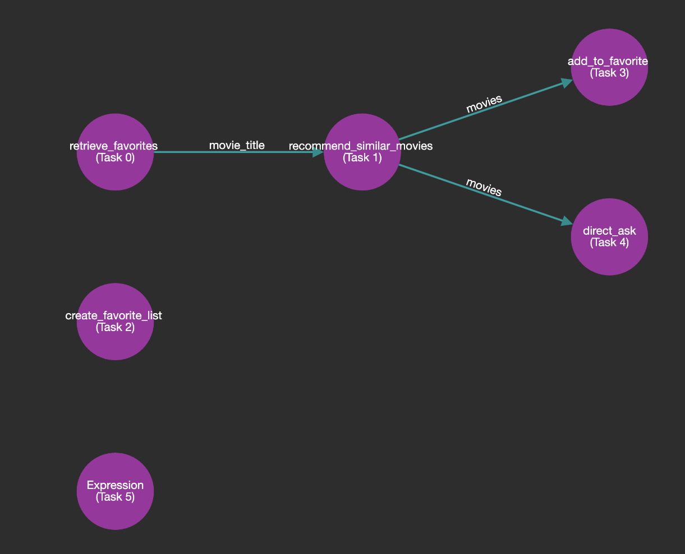

# Tool4AI

**Tool4AI** is a powerful library for **building and executing complex dependency graphs for function calling and tool routing in AI applications**. It excels at breaking down intricate queries, creating optimized execution plans, and managing dynamic scenarios with ease.


## Key Features

- **Intelligent Query Decomposition**: Breaks down complex, multi-step queries into atomic sub-queries.
- **Optimized Execution Graph**: Generates and visualizes dependency-aware execution plans for maximum efficiency.
- **Parallel Execution**: Executes independent tasks concurrently for optimal performance.
- **Dynamic Human Interaction**: Supports mid-execution pausing, human feedback, and seamless resumption.
- **Persistent State Management**: Saves and resumes execution states using JSON or LMDB storage.
- **Model Agnostic**: Works effectively with various language models, from small to large LLMs.

## Building the Execution Graph

Tool4AI's primary strength lies in its ability to construct and visualize complex execution graphs. Here's how to get started:

```python
from tool4ai import Router, Toolkit, Tool
from tool4ai.toolmakers import OpenAIToolMaker
from tool4ai.graph import ToolDependencyGraph

# Assuming you already have your functions and their JSON schemas defined
# Define your tool functions
async def retrieve_favorites(args):
    # Implementation
    pass

async def recommend_similar_movies(args):
    # Implementation
    pass

# ... (other tool functions)

tool_functions = {
    "retrieve_favorites": retrieve_favorites,
    "recommend_similar_movies": recommend_similar_movies,
    # ... (other tool functions)
}

# Define your toolkit
toolkit = Toolkit()
toolkit.add_tool(Tool(name="retrieve_favorites", schema=..., description="Retrieve movies from a favorite list", f= tool_functions["retrieve_favorites"]))
toolkit.add_tool(Tool(name="recommend_similar_movies", schema=..., description="Recommend similar movies", f= tool_functions["recommend_similar_movies"]))
toolkit.add_tool(Tool(name="create_favorite_list", schema=..., description="Create a new favorite list", f= ...))
toolkit.add_tool(Tool(name="add_to_favorite", schema=..., description="Add movies to a favorite list", f=...))
toolkit.add_tool(Tool(name="direct_ask", schema=..., description="Get direct information about movies", f=...))

# Create a router
tool_maker = OpenAIToolMaker()
router = Router(toolkit, tool_maker)

# Process a complex query
query = """Find a horror movie from my 'Scary Nights' list, recommend similar movies, and add them to a new list called 'More Nightmares'. I can't wait to dive into these! Finally, let me know if any of these movies are based on true stories"""

# Voila! The execution graph is ready
graph : ToolDependencyGraph = router.route(query)

# Visualize the execution graph
graph.visualize("execution_graph")
```

This will generate an execution graph similar to the one shown below. The graph represents the decomposition of the complex query into manageable sub-queries and their dependencies.

### Subquery Node Structure

```py
class SubQuery(BaseModel):
    index: int = 0 # index of the sub-query
    sub_query: str # original sub-query, exactly as it appears in the input
    task: str # rewritten task for the sub-query
    tool: Optional[str] = None # detected tool name for the sub-query
    dependent_on: int = -1 # index of the sub-query this sub-query is dependent on if any
    dependency_attr: Optional[str] = "" # attribute of the dependent sub-query this sub-query depends on if any
    arguments: Optional[Dict[str, Any]] = Field(default_factory=dict) # arguments for the tool function, this is populated during execution
    result: Optional[str] = None # result of the sub-query, this is populated during execution
    status: Optional[str] = "pending" # status of the sub-query, this is updated during execution
    issue: Optional[str] = None # issue encountered during execution
    actionable: Optional[bool] = True # whether the sub-query is actionable
    is_orphan: Optional[bool] = False # whether the sub-query is an orphan, refer to the documentation for more details

class SubQueryResponse(BaseModel):
    sub_queries: List[SubQuery] # list of sub-queriesor 
```

### Graph Structure

The resulting graph structure can be serialized to JSON for storage or visualization:

```json
{
  "sub_queries": [
    {
      "index": 0,
      "sub_query": "Find a horror movie from my 'Scary Nights' list.",
      "task": "Retrieve a horror movie from the 'Scary Nights' list.",
      "tool": "retrieve_favorites",
      "dependent_on": -1,
      "dependency_attr": ""
    },
    {
      "index": 1,
      "sub_query": "Recommend similar movies.",
      "task": "Recommend movies similar to the selected horror movie from the 'Scary Nights' list.",
      "tool": "recommend_similar_movies",
      "dependent_on": 0,
      "dependency_attr": "movie_title"
    },
    {
      "index": 2,
      "sub_query": "Create a new list called 'More Nightmares'.",
      "task": "Create a new favorite list named 'More Nightmares'.",
      "tool": "create_favorite_list",
      "dependent_on": -1,
      "dependency_attr": ""
    },
    {
      "index": 3,
      "sub_query": "Add them to a new list called 'More Nightmares'.",
      "task": "Add the recommended movies to the 'More Nightmares' list.",
      "tool": "add_to_favorite",
      "dependent_on": 1,
      "dependency_attr": "movies"
    },
    {
      "index": 4,
      "sub_query": "Let me know if any of these movies are based on true stories.",
      "task": "Determine if any of the recommended movies are based on true stories.",
      "tool": "direct_ask",
      "dependent_on": 1,
      "dependency_attr": "movies"
    },
    {
      "index": 5,
      "sub_query": "I can't wait to dive into these!",
      "task": "Acknowledge user's excitement about diving into the new list of movies.",
      "tool": "",
      "dependent_on": -1,
      "dependency_attr": ""
    }
  ]
}
```



This structure allows for clear visualization of task dependencies and efficient execution planning.

## Executing the Graph

Once the execution graph is built, Tool4AI provides powerful capabilities to execute it:

```python
# Execute the graph
result : ExecutionResult = await graph.execute(toolkit, context, tool_maker)

print(result.status)
print(result.message)
```

The result structure is as follows:

```py
class ExecutionStatus(str, Enum):
    SUCCESS = "success"
    FAILED = "failed"
    PARTIAL = "partial"
    HUMAN = "human"
    ERROR = "error"
    PENDING = "pending"
    NEW_DISCUSSION = "new_discussion"

class ExecutionResult(BaseModel):
    model_config = ConfigDict(extra='ignore')
    status: ExecutionStatus
    message: str
    memory: List[Dict[str, Any]]
    sub_queries: List[SubQuery]
    error_info: Optional[Dict[str, Any]] = None
```

### Parallel Execution

Tool4AI optimizes execution by running independent tasks in parallel. The `get_execution_order()` function divides the graph into layers, where tasks within each layer can be executed concurrently:

```python
execution_order = graph.get_execution_order()
for layer in execution_order:
    # Tasks in this layer can be executed in parallel
    pass
```

### Human Interaction and Execution Resumption

Tool4AI supports dynamic human interaction during execution. Here's an example of how it handles human input and resumes execution. Imagine a user asks the AI assistant to search for horror movies from 2020, but no data is available. The execution pipeline will halt at the related node or subquery with the status `ExecutionStatus.HUMAN`, waiting for user input to proceed. Once the user provides feedback, the execution will resume seamlessly.

```python
# Initial execution
result = await graph.execute(tool_functions, toolkit.to_json_schema(), context, tool_maker)

if result.status == ExecutionStatus.HUMAN:
    # Simulate human input
    user_input = "Yes, please search for comedy movies from 2021 instead."
    result = await graph.resume_execution(user_input, tool_functions, toolkit.to_json_schema(), context, tool_maker)

assert result.status == ExecutionStatus.SUCCESS
```

This allows for seamless integration of human feedback into the execution process.

## Persistent State Management

Tool4AI can save and resume execution states, allowing for long-running or interruptible processes:

```python
# Save state
await graph.save()

# Load state
loaded_graph = await ToolDependencyGraph.load(graph.run_id)
```

## Model Agnostic Design

While Tool4AI shines with large language models, it's designed to work effectively even with smaller models that have limited function-calling capabilities.

## Installation

Install Tool4AI using pip from github:

```bash
pip install git+https://github.com/unclecode/tool4ai.git
```

## Contributing

We welcome contributions! Please see our [Contributing Guide](CONTRIBUTING.md) for more details.

## License

Tool4AI is released under the [MIT License](LICENSE).

## Support

For support, please open an issue on the GitHub repository or contact [unclecode@kidocode.com].
